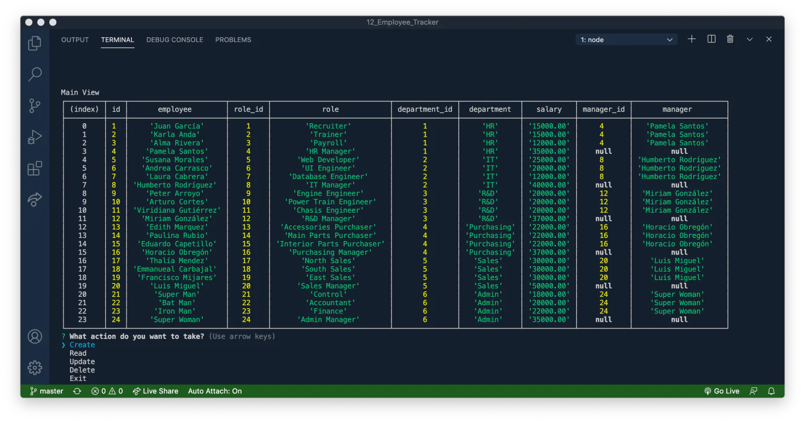

# 🧑‍💼 Employee Tracker

### A clean terminal-based employee manager for quickly handling departments, roles, and people in a MySQL database.

Employee Tracker is a Node.js CLI app built for the classic "company org data" workflow, but with a smoother setup and a more practical project structure. It lets you manage employees, roles, and departments from the terminal without touching SQL every time.

---

## ✨ Features

| | Feature | What It Does |
|---|---|---|
| 👥 | Employee CRUD | Create, view, update, and delete employee records from prompts. |
| 🧩 | Role Management | Manage job titles, salaries, and department assignments. |
| 🏢 | Department Management | Add, edit, and remove departments directly from the CLI. |
| 👔 | Employees by Manager | Filter employees by `manager_id` to inspect reporting lines. |
| 💰 | Department Budget View | Shows total salary budget by department using SQL aggregation. |
| 🖥️ | Terminal-First UX | Inquirer menus + table output + ASCII banner make it easy to use. |

---

<p align="center">
  
</p>

---

## 🛠️ Tech Stack


---

## 🧩 Project Snapshot

- `src/index.js`: CLI flow, prompts, menus, and table display logic.
- `src/scripts/ensureDatabase.js`: prestart check that auto-starts MySQL in Docker when needed.
- `src/lib/query.js`: builds CRUD SQL queries and runs them with `mysql2/promise`.
- `src/lib/loadEnv.js`: lightweight `.env` loader so local secrets stay out of source code.
- `docker-compose.yml`: local MySQL container setup with persistent volume.
- `db/schema.sql`: creates `Departments`, `Roles`, and `Employees` tables.
- `db/seeds.sql`: inserts sample data for quick testing and demos.
- `assets/`: screenshots/GIF used in documentation.

---

## 🚀 Live Demo


Being a CLI, this project is ready to run locally 😉.

---

## 💻 Run It Locally

1. Install requirements (one-time): Node.js (LTS) and Docker Desktop.

2. Open Docker Desktop and wait until it shows as running.

3. Clone and install dependencies:

```bash
git clone https://github.com/jorguzman100/employee-tracker.git
cd employee-tracker
npm install
```

4. Start the CLI:

```bash
npm start
```

CLI entry point: `src/index.js` (through `npm start`)

On first start, `npm start` automatically:

- Starts MySQL in Docker if it is not already running.
- Creates the database/tables if needed.
- Seeds sample data if tables are empty.

Optional: create `.env` only if you want custom DB settings (defaults already work):

```bash
cp .env.example .env
```

<details>
<summary>🔑 Required environment variables</summary>

```env
# .env
DB_HOST=127.0.0.1
DB_PORT=3306
DB_USER=root
DB_PASSWORD=your_mysql_password
DB_NAME=employeesDB
```
</details>

`.env` is in `.gitignore`; keep real credentials only in your local `.env` file.

### Common setup errors

- `Database startup failed: Could not start MySQL with Docker`: install and open Docker Desktop, then run `npm start` again.
- `Access denied for user`: if you use `.env`, check `DB_USER` and `DB_PASSWORD`.
- Port `3306` already in use: stop your local MySQL service or change `DB_PORT` in `.env`.

---

## 🤝 Contributors

- **Jorge Guzman** · [@jorguzman100](https://github.com/jorguzman100)
